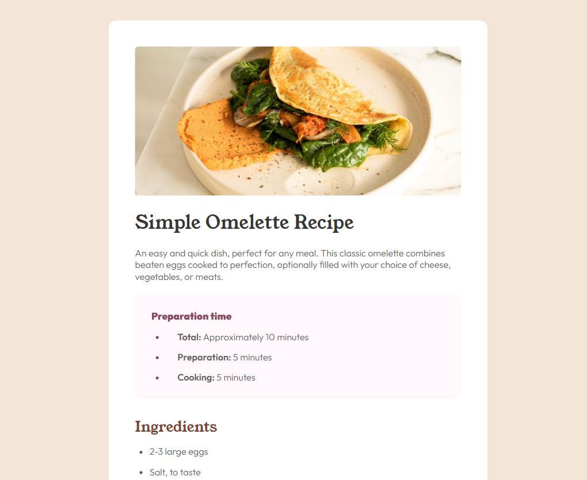

# 🍳 Recipe Page - Frontend Mentor Challenge



Status do Projeto: ✅ Concluído

## 📝 Sobre o Projeto

Este é um desafio do **Frontend Mentor** que consiste em criar uma página de receita responsiva, focada em semântica HTML e estilização precisa com CSS. O objetivo é reproduzir o design o mais fielmente possível, garantindo uma boa experiência de leitura em dispositivos móveis e desktop.

## 🚀 Tecnologias Utilizadas

- **HTML5:** Estrutura semântica (uso de `main`, `section`, `table`, `ol`, `ul`).
- **CSS3:** Estilização personalizada, Google Fonts e Layout Responsivo.
- **CSS Grid & Flexbox:** Para organização dos componentes e alinhamento do card.
- **Mobile-First:** Desenvolvimento focado primeiro em telas menores.

## 🛠️ Desafios Superados

Durante o desenvolvimento, foquei em resolver problemas comuns de layout, como:

- **Alinhamento de Listas:** Ajuste fino do `list-style-position` para que as quebras de linha ficassem perfeitamente alinhadas à margem esquerda.
- **Tabelas Customizadas:** Estilização de bordas de tabelas usando `border-collapse` e remoção da borda da última linha com `:last-child`.
- **Nth-child:** Aplicação de cores alternadas e seletores específicos para destacar dados nutricionais.
- **Responsividade:** Garantir que o card de receita se adapte de telas pequenas até monitores grandes.

## 🎨 Design Original

O layout foi baseado no guia de estilo fornecido:

- **Fontes:** _Young Serif_ (títulos) e _Outfit_ (corpo do texto).
- **Cores:** Tons de marrom, rosa pálido e cinza escuro para simular um papel de receita real.

## 💻 Como Visualizar

1. Clone este repositório:

   ```bash
   git clone https://github.com/JoselmaDevLab/recipe-page.git

   ```

2. Navegue até a pasta:

   ```Bash
   cd recipe-page
   ```

3. Abra o arquivo index.html em seu navegador favorito.

   Projeto desenvolvido por Joselma - Conecte-se comigo no GitHub! 👩‍💻
